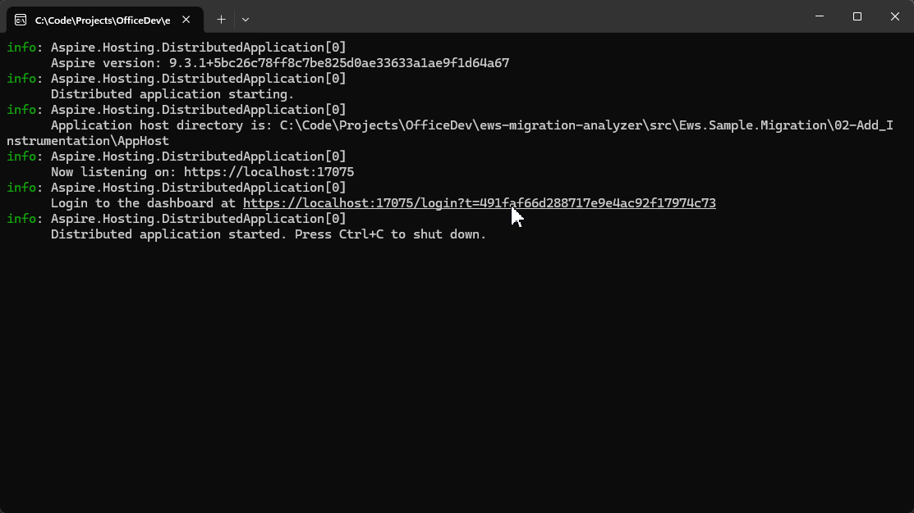
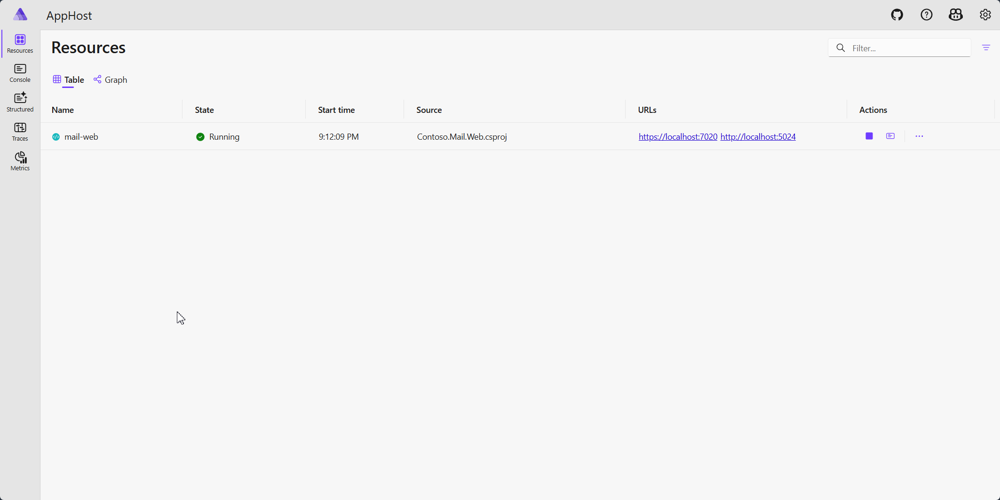
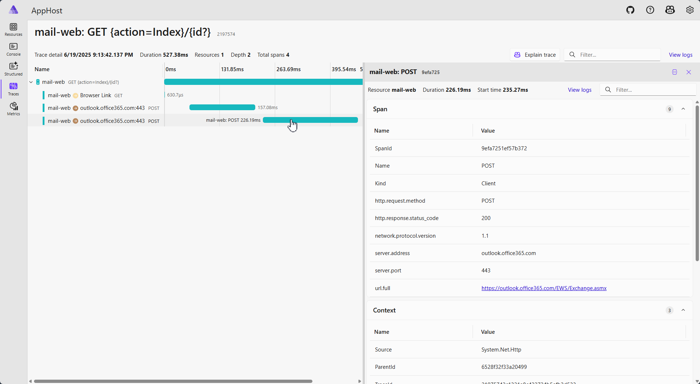
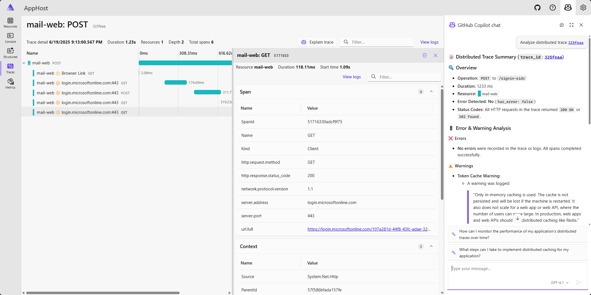
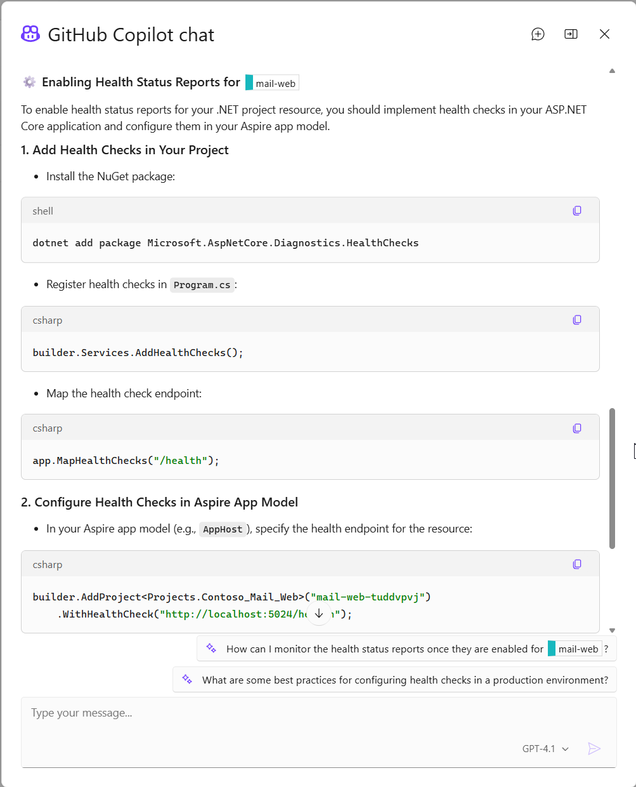

# 02-Add Instrumentation

## Overview

The solution in this folder adds instrumentation using Aspire and UI tests using Playwright to the Contoso Mail sample application. Aspire adds value even though this application is not very complex because it improves the inner loop for developers and observability of the application backend where all of the code and configuration changes will occur. Aspire also provide a smooth path to an improved deployment story and support for additional services if the application is extended now or in the future.

The other improvement we should make now before we start changing the code to replace EWS is to add automated tests to the application to ensure the user experience is not impacted by the changes and we detect any regressions as early as possible. Playwright is a great tool for testing the user experience. We'll also look for opportunities to add unit tests for some of the business logic that does not need to reside with the EWS code.

## Step-by-Step Guide

### Instrumentation with Aspire

Adding Aspire to the solution is easy to do:

1. Add new `Aspire ServiceDefaults` project to the solution
1. Add new `Aspire AppHost` project to the solution
1. In the `AppHost` project add a project reference to `Contoso.Mail.Web`
1. In `Contoso.Mail.Web` add a project reference to `ServiceDefaults`
1. In `Contoso.Mail.Web\Program.cs` after line 9 (`var builder = WebApplication.CreateBuilder(args);`) add `builder.AddServiceDefaults();`
1. In the `AppHost` project after line 1 add `var web builder.AddProject<Projects.Contoso_Mail_Web>("mail-web);`
1. Select `AppHost` as the startup project
1. Start the application (`F5`)

#### Launch

Starting the application will launch a command window. In the log there will be a link to the Aspire dashboard

When you open the link, the browser should bring up the Aspire dashboard and the `mail-web` application should be starting up or already be running.

From here you can launch the web site, view logs and traces and dig into metrics for your application.

In the most recent versions of Aspire (v0.9.2 and later) you can also access GitHub Copilot from the dashboard to help explain error messages and provide suggestions to improve observability and resilience for your application.

With that we are in a good position to understand and detect issues on the operational side of the application. Let's turn to the user experience and make sure we can have the same level of confidence about how our changes affect the users.

## Next Steps
1. Add E2E Tests with Playwright
1. Refactor application for modularity
1. Implement EWS components with Graph API
