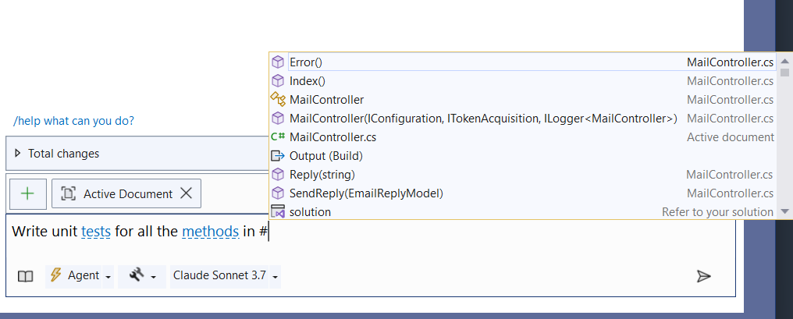
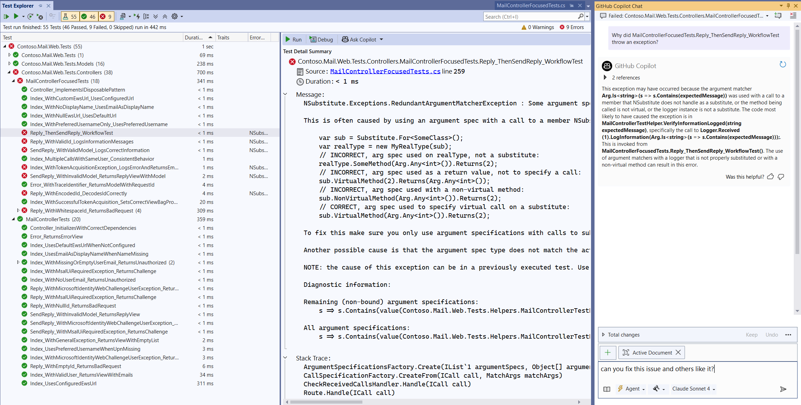
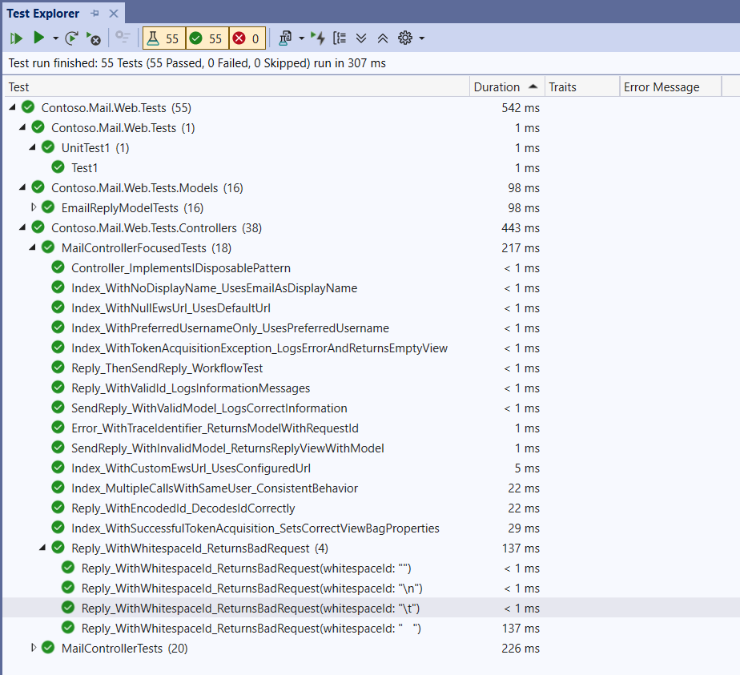
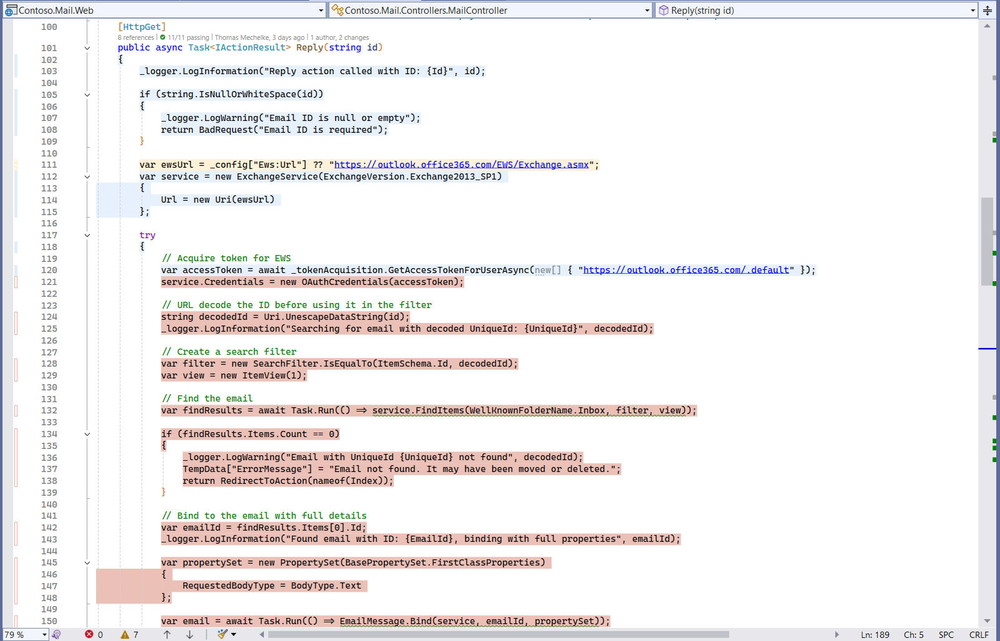

# 03-Add Unit Tests

## Overview

The solution in this folder adds unit tests for the controller and business logic. I'll be using the[XUnit](https://xunit.net/) framework and [NSubstitute](https://nsubstitute.github.io/) but because the majority of tests is created by GitHub Copilot, feel free to substitute your own favorite testing frameworks. The instructions will apply. This will help ensure that the application remains stable as we refactor and replace EWS references with Microsoft Graph API calls.

## Step-by-Step Guide

### Adding Copilot Instructions

We are getting to the point in the migration where we need to ensure that the current design is captured in a way that allows GitHub Copilot to make design choices in alignment with the desired patterns.

If your application is following your current coding guidelines already, you can let GitHub Copilot generate the `.github/copilot-instructions.md` file without further instructions.

Try it by executing the following prompt:

```text
Add Copilot instructions in .github/copilot-instructions.md in the root of the solution based on the current design.
```

If you want to change something about the application architecture, you can tweak the file directly or ask GitHub Copilot to make the updates.

We'll use this approach to ensure best practices are followed for the xUnit tests we are about to create. If you prefer other frameworks, you can adjust the prompt accordingly. The subsequent steps will respect your choice.

The following prompt should have the desired effect:

```text
Add best practices for xUnit  tests and NSubstitute to the .github/copilot-instructions.md file.
```

From this point forward, the copilot-instructions.md file will be automatically added to the references for each prompt you run. You can revisit it at any time if you notice patterns you want to change globally. For more information on how to use the copilot-instructions.md file, see the [GitHub Copilot documentation](https://docs.github.com/en/copilot/coding-with-copilot/configuring-copilot-for-your-repository).

### Adding XUnit Tests

To add unit tests simply run the following prompt:

```text
Write unit tests for all methods in #MailController.cs.
```



This should result in a new test project using xUnit and NSubstitute as prescribed in `copilot-instructions.md`, add the project reference to the `Contoso.Mail.Web` project, and add a test class with some sample tests. It will also add the necessary NuGet packages to the test project.

In the build I used, GitHub Copilot got stuck while adding the web project reference to the test project. I stopped the prompt, added the reference manually and then asked Copilot to continue. Sometimes it's easier to execute a function in the IDE than trying to iterate prompts to get Copilot to fix mistakes.

After the tests were created, running the the build, showed a few errors that were easily fixed. A common one, which is likely to occur during refactoring as well is the ambiguous reference between `Microsoft.Exchange.WebServices.Data.Task` and `System.Threading.Tasks.Task`. GitHub Copilot suggested the correct fix options of aliasing Task to System.Threading.Tasks.Task or fully qualifying the type. Because there are many references to System.Threading.Tasks.Task in the code, I chose the alias option and Copilot added the following line to the top of the test class:

```csharp
using Task = System.Threading.Tasks.Task;
```

### Run and Review Tests

The models used by GitHub Copilot evolve and your mileage may vary depending on the the model and version you are using. With Claude Sonnet 4, GitHub Copilot generated 55 tests in the `Contoso.Mail.Web.Tests` project, which is a good start. It's important to run and review the test results to understand if the errors are because of the test d
esign or if they are actually detecting errors in the system under test. You can run the tests using the test explorer in Visual Studio or by running `dotnet test` from the command line.



The test run revealed a number of failed tests with similar errors related to issues with the NSubstitute mocks. Future models might do better here but for now, we have to address these issues iteratively.

In the command bar of the Test Explorer message panel is the option to Ask Copilot to about the failure. In this case, the analysis was correct and I could ask Copilot to fix the issue with the test and others like it in a single prompt.

After that only one test failed.`Reply_WithWhiteSpaceId_ReturnsBadRequest` failed in 3 of the 4 cases Copilot generated.


A quick lock at the test results and the parameter values showed that the test worked for empty string but not for other white space characters. Sure enought, the code in the controller checked for string.IsNullOrEmpty but not for other white space characters. Changing the controller code to use `string.IsNullOrWhiteSpace` fixed the issue and the test passed.



### Code Coverage

One reliable measure of the quality of unit tests is code coverage. The tests generated by GitHub Copilot provide a good starting point for coverage but do not cover all code paths. You can use the Code Coverage feature in Visual Studio to see which lines of code are covered by the tests.


The initial set of tests provides good coverage for validation code in the controllers but does not cover the code that handles authentication and calls into the EWS API.



This is expected and highlights an area that will benefit from refactoring. The additional challenge with testing the interaction with EWS is that it requires a live connection to Exchange Online to fully test the code. This is not ideal for unit tests, which should be isolated from external dependencies. We will address this in the next steps by refactoring the application to use interfaces and dependency injection, allowing us to mock the EWS API calls in the tests.

Another way to improve the code coverage is to add integration tests that run against a live Exchange Online instance or UI tests using a framework like [Playwright](https://playwright.dev/). This will allow us to test the interaction with EWS and ensure that the application works as expected in a real-world scenario.

For now we'll shift our focus to refactoring the application to make it more modular, testable and enable us to swap out the EWS implementation with a Graph API implementation.

## Next Steps

1. Refactor application for modularity
1. Implement EWS components with Graph API
